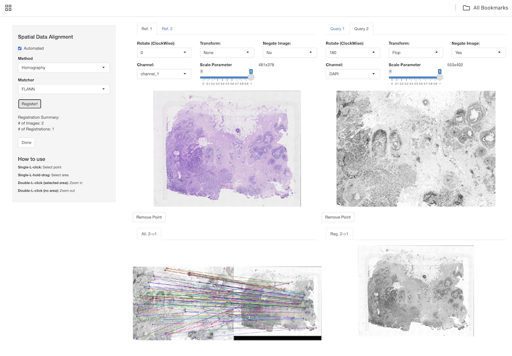
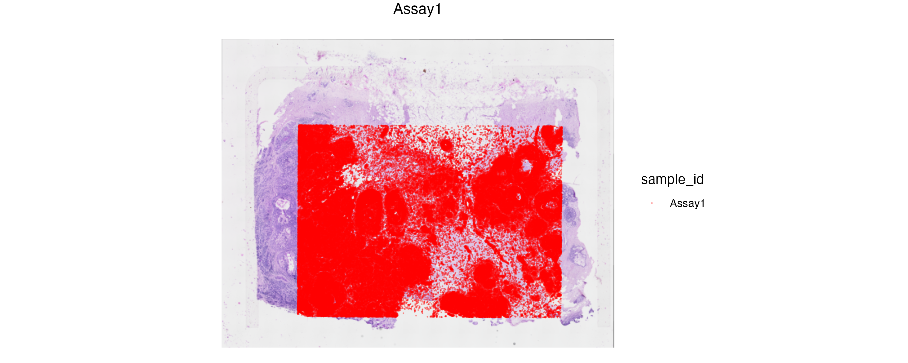

# Spatial registration

## Introduction


## Single Cell vs ST integration

Spatial registration methods use gene expression profiles for cell populations of interest from single-cell RNA sequencing data as a reference, and use these single-cell expression profiles to 'spatially register' the spatial coordinates of observations corresponding to these cell populations in spatial transcriptomics data.

## ST vs ST integration (Alignment)

Spatial omic technologies provide capabilities to capture omic profiles of cells and spots over tissue sections as well as the morphological features of these tissues. Multiple data modalities and microscopy images could be generated with numerous spatial omic instruments where the data generated from these modalities may capture observations (cells, spots, images etc.) in different units and perspectives (i.e. coordinate systems). These could be datasets generated from the same section, adjacent sections or tissue sections with similar morphology and structure. 

Image registration and alignment methods provide transformation functions to map spatial localization of observations from one coordinate system to the other. In this section, we cover R packages and Python modules that store, manipulate and transform the coordinate of such spatial data modalities.   

### Dependencies

We first start by loading BioConductor/CRAN dependencies that will allow us to parse and visualize microscopy images that are generated with or alongside with Imaging-based platforms. 

```{r, echo=FALSE, message=FALSE, warning=FALSE}
library(STexampleData)
library(SpatialExperiment)
library(ggspavis)
library(EBImage)
library(RBioFormats)
library(magick)
if(!requireNamespace("remotes"))
  BiocManager::install("remotes")
if(!requireNamespace("VoltRon"))
  remotes::install_github("BIMSBbinfo/VoltRon")
library(VoltRon)
```

```{r deps, message=FALSE, warning=FALSE}
library(STexampleData)
library(SpatialExperiment)
library(ggspavis)
library(EBImage)
library(RBioFormats)
library(magick)
if(!requireNamespace("remotes"))
  BiocManager::install("remotes")
if(!requireNamespace("VoltRon"))
  remotes::install_github("BIMSBbinfo/VoltRon")
library(VoltRon)
```

### Xenium vs Post-Xenium H&E Alignment

For this use case, we use the Janesick Breast Cancer replicate 1 sample generated by Xenium in situ platform which is available from `r BiocStyle::Biocpkg("STexampleData")`. 

```{r, message=FALSE, warning=FALSE}
XeniumR1 <- Janesick_breastCancer_Xenium_rep1()
XeniumR1
```

The `SpatialExperiment` of the Xenium data does not include any images, to perform the spatial alignment via image registration. We add the DAPI stained image channel to the object. We use the `morphology_mip.ome.tif` file provided in the Xenium output and use `r BiocStyle::Biocpkg("EBImage")` package to parse a specific resolution from the image pyramid. We choose the lowest resolution image and define the parameter for scaling spatial coordinates of cells according to the selected resolution. See [here](https://kb.10xgenomics.com/hc/en-us/articles/11636252598925-What-are-the-Xenium-image-scale-factors) for more information on image scale factors. 

```{r, eval=FALSE, message=FALSE, warning=FALSE}
resolution_level <- 7
scaleparam <- 0.2125*(2^(resolution_level-1))
ome.tiff.dapi <- RBioFormats::read.image("morphology_mip.ome.tif",
                                         resolution = resolution_level)
```

Before adding the selected image to the `SpatialExperiment` object, we normalize the contrast to 1 and then we save the image to a temporary `.png` file.

```{r, eval=FALSE, message=FALSE, warning=FALSE}
ome.tiff.dapi <- (ome.tiff.dapi/max(ome.tiff.dapi)) 
EBImage::writeImage(ome.tiff.dapi, files = "Xenium_DAPI_res7.png", type = "png")
```

```{r, echo=FALSE, message=FALSE, warning=FALSE}
resolution_level <- 7
scaleparam <- 0.2125*(2^(resolution_level-1))
imgfile <- "../images/crs-registration-Xenium_DAPI_res7.png"
```

We can now add the DAPI channel to the `SpatialExperiment` and visualize cells overlaid on the new image.  

```{r, message=FALSE, warning=FALSE}
XeniumR1 <- addImg(XeniumR1, 
                   sample_id = XeniumR1$sample_id[1], 
                   image_id = "DAPI",
                   imageSource = imgfile, 
                   scaleFactor = 1/scaleparam, 
                   load = TRUE)
```

```{r, message=FALSE, warning=FALSE}
img <- imgRaster(XeniumR1)
scale.factors <- scaleFactors(XeniumR1, sample_id = TRUE, image_id = TRUE)
coords <- spatialCoords(XeniumR1)*scale.factors
coords <- data.frame(coords, colour = colData(XeniumR1)[["sample_id"]])
coords$y_centroid <- dim(img)[1] - coords$y_centroid
ggspavis::plotVisium(XeniumR1, annotate = "sample_id", spots = FALSE) +
  geom_point(data = data.frame(coords, colour = colData(XeniumR1)[["sample_id"]]), 
             mapping = aes(x = x_centroid, y = y_centroid, fill = colour), 
             size = 0.01, 
             colour = "red", 
             alpha = 0.3)
```

We will employ the `r BiocStyle::Githubpkg("BIMSBBioinfo/VoltRon")` package on GitHub to align the Xenium data with the post Xenium H&E images captured from the same tissue section following the Xenium in situ experiment. We define a VoltRon object from an H&E image using the `importImageData` function but first select a resolution from the `ome.tiff` file of the H&E. 

```{r, eval=FALSE, message=FALSE, warning=FALSE}
ome.tiff.he <- RBioFormats::read.image("GSM7780153_Post-Xenium_HE_Rep1.ome.tif",
                                         resolution = 7)
EBImage::writeImage(ome.tiff.he, files = "Xenium_H&E_res7.png", type = "png")
```

```{r, eval=FALSE, echo=FALSE, message=FALSE, warning=FALSE}
HE_image_vr <- importImageData(image = "../images/crs-registration-Xenium_H&E_res7.png")
```

Before executing the automated registration, we have to convert the `SpatialExperiment` object of the Xenium data into a VoltRon object. The `assay_type` argument requires you to define the spatial entity type of the `SpatialExperiment` which is `cell` for spatial datasets in single cell resolution.

```{r, eval=FALSE, message=FALSE, warning=FALSE}
XeniumR1_vr <- as.VoltRon(XeniumR1, assay_type = "cell", assay_name = "Xenium")
```

The `registerSpatialData` function performs the registration using a mini Shiny application which allows the user to manipulate images of both modalities. Before alignment, we can use the interface to negate the DAPI image (this step is needed to transform the DAPI image to make it similar to the H&E image). Then we rotate and vertically flip the DAPI image to slightly syncronize the perspective of two images before automated alignment can search for transformation landmark points. 

```{r, eval=FALSE, message=FALSE, warning=FALSE}
xen_reg <- registerSpatialData(reference_spatdata = HE_image_vr, query_spatdata = XeniumR1_vr)
```

```{r, echo=FALSE, eval=FALSE, message=FALSE, warning=FALSE}
xen_reg <- registerSpatialData(reference_spatdata = HE_image_vr, query_spatdata = XeniumR1_vr, 
                               mapping_parameters = readRDS("crs-registration-xen_to_he_mapping.rds"), 
                               interactive = FALSE)
```

{width="75%" fig-align="center" alt="The Shiny application interface for alignment Spatial datasets stored in VoltRon objects"}
The returning value of the function will have a list that includes the query spatial data that is registered to the reference. We can also convert the registered Xenium data using `as.SpatialExperiment` function available in `VoltRon`.

```{r, eval=FALSE, message=FALSE, warning=FALSE}
XeniumR1_reg <- as.SpatialExperiment(xen_reg$registered_spat[[2]])
```

Now the registered Xenium data and the post Xenium H&E image have identical coordinate system, hence we can add the H&E image directly to the registered `SpatialExperiment` object. 

```{r, eval=FALSE, message=FALSE, warning=FALSE}
XeniumR1_reg <- addImg(XeniumR1_reg, 
                       sample_id = XeniumR1_reg$sample_id[1], 
                       image_id = "H&E",
                       imageSource = "Xenium_H&E_res7.png", 
                       scaleFactor = 1, 
                       load = TRUE)
```

```{r, eval=FALSE, echo=FALSE, message=FALSE, warning=FALSE}
XeniumR1_reg <- addImg(XeniumR1_reg, 
                       sample_id = XeniumR1_reg$sample_id[1], 
                       image_id = "H&E",
                       imageSource = "../images/crs-registration-Xenium_H&E_res7.png", 
                       scaleFactor = 1, 
                       load = TRUE)
```

```{r, eval=FALSE, message=FALSE, warning=FALSE}
img <- imgRaster(XeniumR1_reg)
scale.factors <- scaleFactors(XeniumR1_reg, sample_id = TRUE, image_id = TRUE)
coords <- spatialCoords(XeniumR1_reg)*scale.factors
coords <- data.frame(coords, colour = colData(XeniumR1_reg)[["sample_id"]])
coords$y_centroid <- dim(img)[1] - coords$y_centroid
ggspavis::plotVisium(XeniumR1_reg, annotate = "sample_id", image_ids = "H&E", spots = FALSE) +
  geom_point(data = data.frame(coords, colour = colData(XeniumR1_reg)[["sample_id"]]), 
             mapping = aes(x = x_centroid, y = y_centroid, fill = colour), 
             size = 0.01, 
             colour = "red", 
             alpha = 0.3)
```

{width="75%" fig-align="center" alt="The Shiny application interface for alignment Spatial datasets stored in VoltRon objects"}

### Spatial alignment algorithms

Alternatively, we can use other R/Python frameworks to automatically or manually align spatial omic datasets across tissue sections. Some of these methods could be used through R using BiocManager packages such as `r BiocStyle::Biocpkg("reticulate")` and `r BiocStyle::Biocpkg("basilisk")`

- **STAlign**: available as a Python module from [GitHub](https://github.com/JEFworks-Lab/STalign).

### References {.unnumbered}


