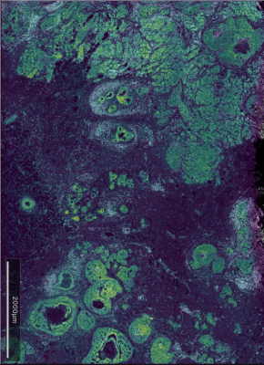
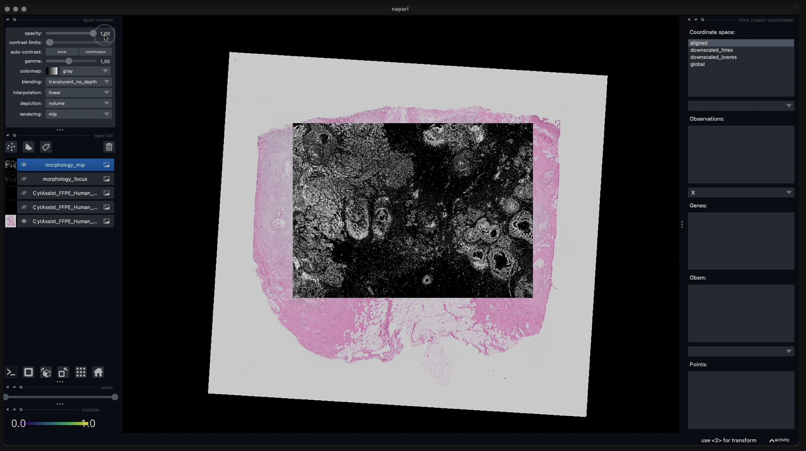

# Workflow: Xenium + Visium

## Preamble

### Dependencies

```{r dep, message=FALSE, warning=FALSE}
library(RANN)
library(scater)
library(scuttle)
library(harmony)
library(ggspavis)
library(patchwork)
library(BayesSpace)
library(STexampleData)
# set seed for random number generation
# in order to make results reproducible
set.seed(194849)
```

### Introduction

{height=300px}
{height=300px}

```{r osf}
library(osfr)
osf <- osf_retrieve_node("https://osf.io/5n4q3")
(dir <- osf_ls_files(osf, pattern="Janesick")$name)
```

```{r vis, message=FALSE, results="hide"}
# retrieve Visium dataset
ids <- grep("Vis", dir, value=TRUE)
sub <- osf_ls_files(osf, ids)
dir.create(tmp <- tempfile())
osf_download(sub, tmp, recurse=TRUE)
# read into 'SpatialExperiment'
library(VisiumIO)
obj <- TENxVisium(
    spacerangerOut=tmp, 
    images="lowres", 
    format="h5")
(vis <- import(obj))
```

```{r xen, message=FALSE, results="hide"}
# retrieve Xenium dataset
ids <- grep("Xen", dir, value=TRUE)
sub <- osf_ls_files(osf, ids)
dir.create(tmp <- tempfile())
osf_download(sub, tmp, recurse=TRUE)
# read into 'SpatialExperiment'
library(SpatialExperimentIO)
(xen <- readXeniumSXE(tmp))
```

```{r include=FALSE}
#vis <- readRDS("~/downloads/janesick_vis_raw (1).rds")
#vis <- Janesick_breastCancer_Visium() #broken
#xen <- Janesick_breastCancer_Xenium_rep1()
```

## Alignment

There are many ways of registering images in R and Python, or using external plug-ins. 

* `SpatialData` [@Marconato2025-SpatialData] is a Python package that requires user-selected landmarks to align images; here we show the registration of Visium onto Xenium in *napari* interface:

{width=50%}

* R packages `r BiocStyle::CRANpkg("RNiftyReg")` [@Clayden2015-RNiftyReg] can be combined with `r BiocStyle::CRANpkg("mmand")` for automated image registration.
After alignment, we will obtain the registered images with a transformation matrix. 
Here is a demonstration with external data, before and after registration of the two slices.
However, the automation does not work well on images with very different orientation, scale, and intensity, such as in this use case of Xenium and Visium.

<center>
{width=66%}
{width=33%}
</center>

* Therefore, we use the transformation matrix provided by 10x, which was obtained by registration Xenium onto Visium in Python with the Fiji [@10xGenomics2023-Fiji] Java plug-in:

```{r mtx}
# simplify spatial coordinate names for visualization
spatialCoordsNames(vis) <- spatialCoordsNames(xen) <- c("x", "y")
# affine matrix for aligning Xenium onto Visium
mtx <- matrix(nrow=2, byrow=TRUE, c(
    8.82797498e-02, -1.91831377e+00, 1.63476055e+04,
    1.84141210e+00,  5.96797885e-02, 4.12499099e+03),
    dimnames=list(c("x", "y"), c("x", "y", "z")))
```
  
```{r new-xy}
# stash original coordinates
old <- spatialCoords(xen)
colData(xen)[c(".x", ".y")] <- old
# apply affine transformation
new <- old %*% t(mtx[, -3]) # scale/rotate &
new <- sweep(new, 2, mtx[, 3], `+`) # offset
spatialCoords(xen) <- new
```

```{r plt-xy, fig.width=3, fig.height=3}
df <- data.frame(spatialCoords(vis))
fd <- data.frame(spatialCoords(xen))
ggplot() + coord_equal() + theme_void() +
    geom_point(aes(x, y), df, col="grey", stroke=0, size=1) +
    geom_point(aes(x, y), fd, col="blue", stroke=0, size=0.1) 
```

## Aggregation

Binning single-cell resolution spatial data into spots can be useful for checking correlations between technical replicates of the same technology, identify artifacts across technologies, and checking cell density (number of cells per spot). 
The user can choose to bin from transcript-level (sub-cellular) or cell-level. 
Our package bin2spot will soon be available to the public after some optimization with the speed in the backend.

To aggregate single cell-level data from Xenium at the spot level, we first do a fixed-radius neighborhood search using `r BiocStyle::CRANpkg("RANN")` (c.f. @sec-img-neighbors) to identify, for ever spot, cells whose centroid lies within a 27.5um distance (given a Visium spot diameter of 55um):

```{r nns, message=FALSE, fig.width=3.5, fig.height=3}
# do a fixed-radius search to get cell 
# centroids that fall on a given spot
nns <- nn2(
    searchtype="radius", radius=55/2/0.2125, k=200,
    data=spatialCoords(xen), query=spatialCoords(vis))
```

```{r plt-ncs, message=FALSE, fig.width=3.5, fig.height=3}
# get cell indices and number of cells per spot
vis$n_cells <- rowSums((idx <- nns$nn.idx) > 0)
plotSpots(vis, annotate="n_cells")
```

Next, we can aggregate single cell-level Xenium data into pseudo-spots. 
In addition, we propagate the Visium data's spatial coordinates, excluding locations of spots without any overlapping cells:

```{r pbs, message=FALSE, fig.width=3, fig.height=3}
# aggregate Xenium data into pseudo-spots
xem <- aggregateAcrossCells(xen[, c(t(idx))], rep.int(seq(ncol(vis)), vis$n_cells))
# propagate Visium data's spatial coordinates, excluding empty pseudo-spots
spatialCoords(xem) <- spatialCoords(vis)[vis$n_cells > 0, ] 
colnames(xem) <- colnames(vis)[vis$n_cells > 0]
xem$in_tissue <- 1
```

Because we've aligned the Xenium to the Visium data, we can propagate the Visium data's `imgData` (low resolution H&E staining) to the object containing pseudo-spot Xenium data:

```{r img}
imgData(xem) <- imgData(vis)
```

Next, let's compute some standard quality control metrics on both, the Visium and pseudo-spot Xenium data.
Besides dataset-specific metrics, we also specify the subset of genes that are shared between both datasets in order to obtain comparable metrics:

```{r qcs}
sub <- list(gs=intersect(rownames(vis), rownames(xen)))
vis <- addPerCellQCMetrics(vis, subsets=sub)
xem <- addPerCellQCMetrics(xem, subsets=sub)
```

Let's visually compare the total counts per (pseudo-)spot between Visium and Xenium:

```{r plt-sum, fig.width=7, fig.height=3}
plotVisium(vis, 
    annotate="subsets_gs_sum",
    zoom=TRUE, facets=NULL) +
    ggtitle("Visium") +
plotVisium(xem, 
    annotate="subsets_gs_sum",
    zoom=TRUE, facets=NULL) +
    ggtitle("Xenium") +
plot_layout(nrow=1) 
```

We can also use a scatter plot - where points = (pseudo-)spots - to directly compare total counts between both technologies:

```{r plt-pts, collapse=TRUE, fig.width=4.5, fig.height=4}
df <- data.frame(
    n_cells=xem$ncells,
    Xenium=xem$subsets_gs_sum,
    Visium=vis[, colnames(xem)]$subsets_gs_sum)
ggplot(df, aes(Xenium, Visium, col=n_cells)) + 
    scale_color_gradientn(colors=rev(hcl.colors(9, "Mako"))) +
    geom_point(alpha=0.5) + theme_bw() + theme(aspect.ratio=1) 
```

## Integration

```{r obj}
# pool datasets together
gs <- intersect(rownames(vis), rownames(xem))
cs <- intersect(colnames(vis), colnames(xem))
.vis <- vis[gs, cs]
.xem <- xem[gs, cs]
.vis$sample_id <- "Visium"
.xem$sample_id <- "Xenium"
cd <- intersect(
    names(colData(vis)), 
    names(colData(xem)))
colData(.vis) <- colData(.vis)[cd]
colData(.xem) <- colData(.xem)[cd]
rowData(.vis) <- NULL
rowData(.xem) <- NULL
assay(.vis) <- as(assay(.vis), "dgCMatrix")
dim(obj <- cbind(.vis, .xem))
```

```{r int}
# minimal filtering
obj <- obj[, obj$subsets_gs_sum > 0]
# library size normalization 
obj <- logNormCounts(obj)
# principal component analysis
obj <- runPCA(obj)
# 'harmony' integration
pcs <- RunHarmony(
    data_mat=reducedDim(obj, "PCA"), 
    meta_data=obj$sample_id, 
    verbose=FALSE)
reducedDim(obj, "PCA") <- pcs
# dimensionality reduction
map <- calculateUMAP(t(pcs))
reducedDim(obj, "UMAP") <- map
```

```{r plt-map, fig.width=3.5, fig.height=3}
plotUMAP(obj, colour_by="sample_id", point_size=0.1) +
    guides(col=guide_legend(override.aes=list(alpha=1, size=2))) +
    theme_void() + theme(aspect.ratio=1, legend.key.size=unit(0, "pt"))
```

## Clustering

The `spatialCluster()` function clusters the spots, and adds the predicted cluster labels to the SingleCellExperiment. Typically, as we did for the analyses in the paper, we suggest running with at least 10,000 iterations (`nrep=10000`), but we use 1,000 iteration in this demonstration for the sake of runtime. (Note that a random seed must be set (`set.seed()`) in order for the results to be reproducible.)

```{r clu, message=FALSE}
xy <- c("array_row", "array_col")
colData(obj)[xy] <- spatialCoords(obj)
# 'BayesSpace' clustering
res <- spatialCluster(obj, q=10, burn.in=100, nrep=1e3)
table(res$k <- factor(res$spatial.cluster))
```

We see high concordance between the two modalities, although the 
aggregated Xenium data appears to yield slightly higher granularity:

```{r plt-clu, collapse=TRUE, fig.width=4, fig.height=2.5}
plotVisium(res, 
    image=FALSE, annotate="k") +
    theme(legend.key.size=unit(0, "pt"))
```

From here on out, both datasets could be analyzed together and/or independently, e.g., in order to identify cluster markers, annotate cell subpopulations etc.

## Appendix

### References {.unnumbered}
